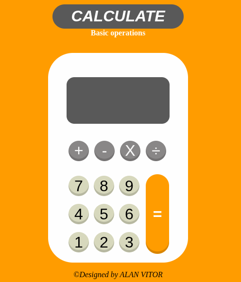

# Calculator

## Overview

A browser calculator application project that allows users to calculate basic math operations. Built as part of The Odin Project course. 

## Features

**Basic math operations:**  

• Addition  

• Subtract  

• Multiply  

• Divide  

## Installation 

1. Clone this repo 
2. Open index.html in your browser 
3. DONE!

## How to use  

• Simply click the UI for the desired operation  

• Press the equal button to get the result 

## Technologies used

• HTML5: Structure UI elements  
• CSS3: Flexbox layout for the buttons; hover effects and styling  
• JAVASCRIPT: logic for operations and event listeners for mouse interactions

## Learning outcomes

**This project helped solidify:**  

• Creating and manipulation DOM elements  
• Handling user events (e.g., mouseover)  
• CSS Flexbox  
• Basic algorithm for calculations using objects

## Contributing

Feel free to fork the repo, create a branch and submit a pull request! Issues and suggestions welcome

## License 

Mit License – Free to use and modify  

*Created by Alan Vitor on sep 29, 2025*
